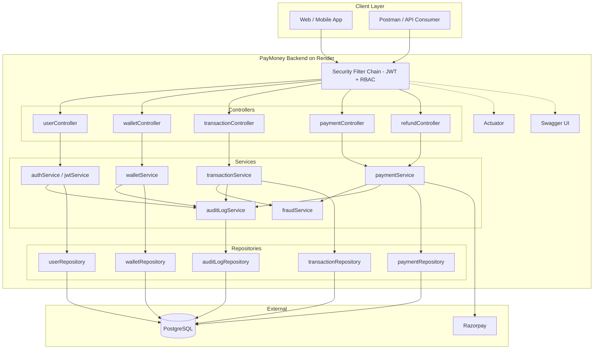
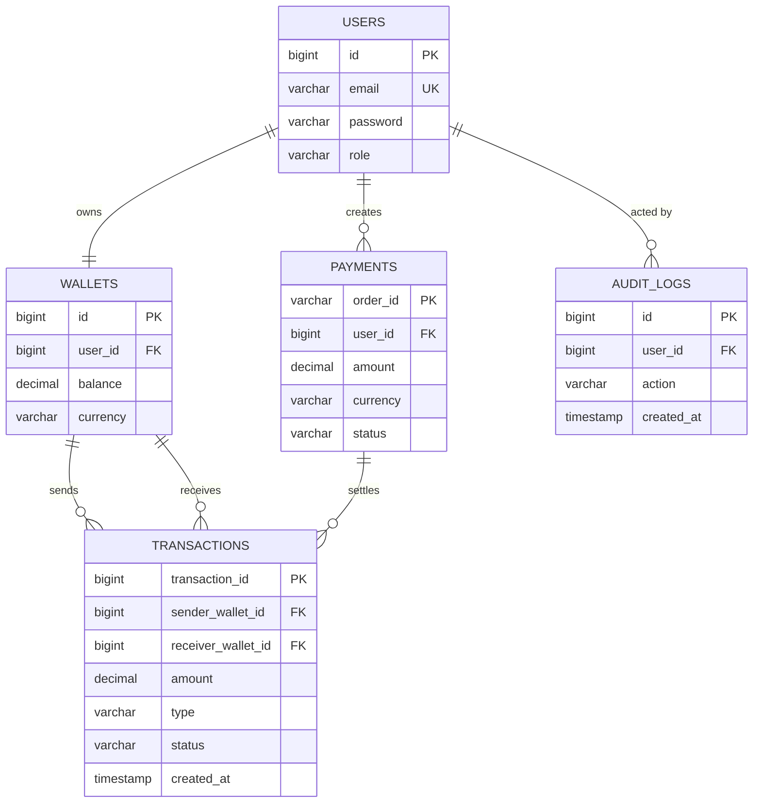
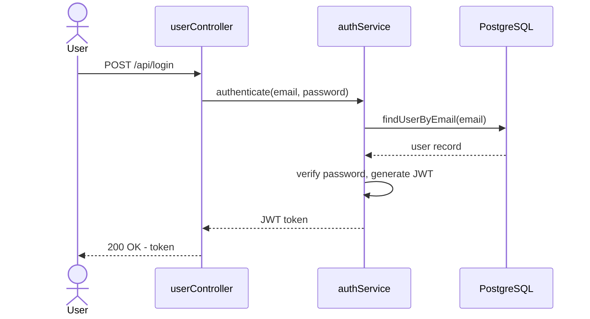
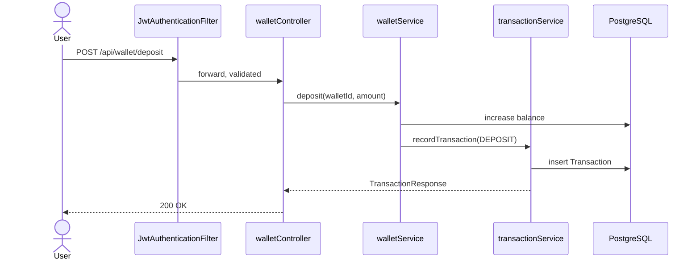
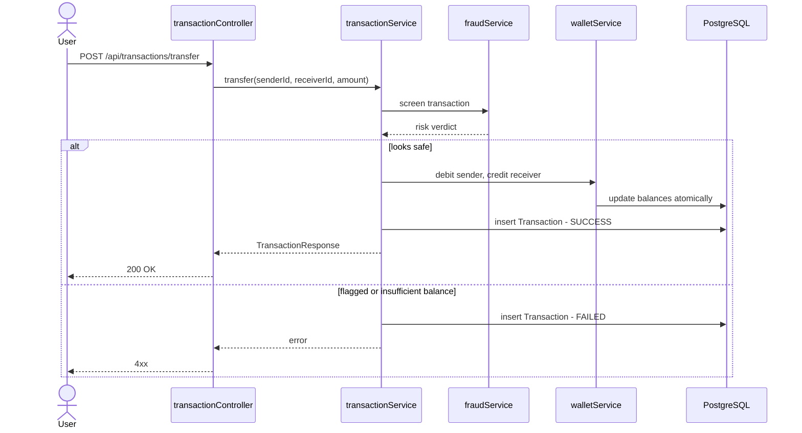
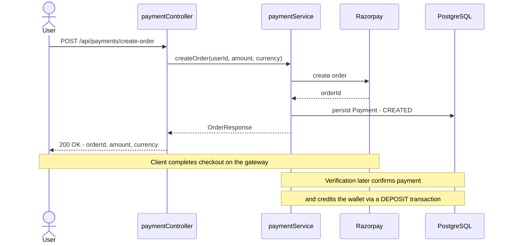

<div align="center">

# 💸 PayMoney
### A Secure FinTech Wallet & Payments Backend — Java 21 · Spring Boot · PostgreSQL


[](https://www.oracle.com/java/)
[](https://spring.io/projects/spring-boot)
[](https://www.postgresql.org/)
[](https://www.docker.com/)

A wallet-and-payments backend covering the parts of fintech engineering that are actually hard: JWT auth with role-based access, atomic wallet transfers, Razorpay-backed payments, fraud screening, idempotent retries, and a full audit trail — built end-to-end and deployed live.

**[🚀 Live API](https://paymoney-backend-ybl6.onrender.com) · [📘 Swagger Docs](https://paymoney-backend-ybl6.onrender.com/swagger-ui/index.html) · [❤️ Health Check](https://paymoney-backend-ybl6.onrender.com/actuator/health)**

### 📫 Let's Connect

I'm actively looking for Java devloper/Backend/SDE opportunities — always happy to talk about system design, payments infrastructure, or this project in detail.

[](https://www.linkedin.com/in/ayush-sinha-7611572a1/)
[](mailto:ayush21052003@gmail.com)
[](https://github.com/VASUSINH)
[](https://github.com/VASUSINH/VASUSINH)


</div>

---

## 📸 Preview

<table>
  <tr>
    <td align="center" width="50%">
      <b><h3>🔐 Login</h3></b>
      
    </td>
    <td align="center" width="50%">
      <b><h3>💰 Wallet Deposit</h3></b>
      
    </td>
  </tr>
  <tr>
    <td align="center" width="50%">
      <b><h3>🔁 Wallet Transfer</h3></b>
      
    </td>
    <td align="center" width="50%">
      <b><h3>💳 Payment Order</h3></b>
      
    </td>
  </tr>
</table>

---

## ⭐ Highlights

*A quick, scannable summary of what this project demonstrates:*

- 🔐 **Secure auth** — stateless JWT login with role-based access control (`SecurityConfig`, `JwtAuthenticationFilter`)
- 💸 **Real money-movement logic** — atomic wallet-to-wallet transfers, deposits, and withdrawals with a full transaction ledger
- 💳 **Live payment gateway integration** — Razorpay order creation, payment verification, and refunds (`razorpayConfig`, `paymentService`, `refundController`)
- 🛡️ **Risk-aware design** — a dedicated `fraudService` and idempotency handling (`idempotencyEntity`/`idempotencyRepository`) to guard against duplicate or suspicious transactions
- 📜 **Audit-ready** — an append-only audit log (`auditLogEntity`, `auditLogService`) for compliance-style traceability
- 🗃️ **Managed schema evolution** — versioned SQL migrations via Flyway (`V1__`, `V2__`)
- 🐳 **Deployed, not just demoed** — Dockerized, live on Render, with Swagger docs and an Actuator health check publicly reachable
- 🧱 **Clean layered architecture** — Controller → Service → Repository, with dedicated Mapper, DTO, and centralized Exception-handling layers

**Keywords:** Java 21 · Spring Boot · Spring Security · Spring Data JPA · JWT · PostgreSQL · Flyway · Docker · Razorpay · REST API · Postman · RBAC

---

## 🛠 Tech Stack

| Layer | Technology |
|---|---|
| Language & Framework | Java 21, Spring Boot 4.1.1, Spring Web MVC |
| Security | Spring Security, custom JWT filter, role-based access control |
| Data | Spring Data JPA (Hibernate), PostgreSQL, Flyway migrations |
| Payments | Razorpay (order creation, verification, refunds) |
| Reliability | Custom fraud-screening service, idempotency keys, audit logging |
| Docs & Ops | Swagger / OpenAPI, Spring Boot Actuator |
| Build & Infra | Maven, Docker, Git/GitHub |
| Testing & Tooling | Postman (API collection), IntelliJ IDEA |

---

## 🚀 Development Phases

Built in structured, incremental phases rather than all at once:

- ✅ Phase 1 — Project Setup & Git
- ✅ Phase 2 — User Management & PostgreSQL + JPA
- ✅ Phase 3 — DTO + Validation + Exception Handling
- ✅ Phase 4 — Authentication + JWT
- ✅ Phase 5 — Authorization + RBAC
- ✅ Phase 6 — Wallet Management
- ✅ Phase 7 — Transactions + `@Transactional`
- ✅ Phase 8 — Razorpay Payment Gateway
- ✅ Phase 9 — Refunds
- ✅ Phase 10 — Fraud Detection
- ✅ Phase 11 — Idempotency
- ✅ Phase 12 — Audit Logging
- ✅ Phase 13 — Flyway + Swagger + Actuator
- ✅ Phase 14 — Testing + Docker + Deployment

---

## 📡 API Reference

> Full interactive documentation is available at the [Swagger UI](https://paymoney-backend-ybl6.onrender.com/swagger-ui/index.html) — the source of truth for exact request/response schemas.

| Method | Endpoint | Auth | Description |
|---|---|:---:|---|
| `POST` | `/api/login` | ❌ | Authenticate and receive a JWT |
| `POST` | `/api/wallet/deposit` | ✅ | Deposit into the authenticated user's wallet |
| `POST` | `/api/transactions/transfer` | ✅ | Transfer funds between two wallets |
| `POST` | `/api/payments/create-order` | ✅ | Create a Razorpay order for a wallet top-up |
| — | Payment verification & refunds | ✅ | Exposed via `paymentController` / `refundController` — see Swagger for exact routes |
| `GET` | `/actuator/health` | ❌ | Service health/liveness check |

<details>
<summary><b>Example requests & responses (click to expand)</b></summary>

**Login**
```http
POST {{baseUrl}}/api/login
Content-Type: application/json

{ "email": "user@example.com", "password": "••••••••" }
```
```json
{ "token": "<jwt-access-token>" }
```

**Wallet Deposit**
```http
POST {{baseUrl}}/api/wallet/deposit
Authorization: Bearer <jwt-access-token>

{ "amount": 5000 }
```
```json
{
  "transactionId": 6,
  "senderWalletId": null,
  "receiverWalletId": 2,
  "amount": 5000,
  "type": "DEPOSIT",
  "status": "SUCCESS",
  "createdAt": "2026-09-26T07:54:42.677896541"
}
```

**Wallet Transfer**
```http
POST {{baseUrl}}/api/transactions/transfer
Authorization: Bearer <jwt-access-token>

{ "senderWalletId": 1, "receiverWalletId": 2, "amount": 100 }
```
```json
{
  "transactionId": 7,
  "senderWalletId": 1,
  "receiverWalletId": 2,
  "amount": 100,
  "type": "TRANSFER",
  "status": "SUCCESS",
  "createdAt": "2026-09-26T09:46:16.032932895"
}
```

**Create Payment Order**
```http
POST {{baseUrl}}/api/payments/create-order
Authorization: Bearer <jwt-access-token>

{ "amount": 100 }
```
```json
{ "orderId": "order_xxxxxxxxxxxxxx", "amount": 100, "currency": "INR" }
```

> 🔒 All tokens, order IDs, and credentials above are placeholders — no real secrets are stored in this repository.

</details>

---

## 🏗 Architecture & Design (deep dive)

<details>
<summary><b>System Architecture Diagram (click to expand)</b></summary>



**Flow:** `Client → JWT + RBAC filter → Controller → Service → Repository → PostgreSQL`, with fraud checks and audit logging as cross-cutting concerns and an outbound call from the payment service to Razorpay.

</details>

<details>
<summary><b>Database Design / ERD (click to expand)</b></summary>



</details>

<details>
<summary><b>API Flow Diagrams — Login, Deposit, Transfer, Payment Order (click to expand)</b></summary>

**Login**


**Wallet Deposit**


**Wallet Transfer**


**Payment Order Creation**


</details>

<details>
<summary><b>Project Structure (click to expand)</b></summary>

```
PayMoney/
├── src/main/java/com/PayMoney/
│   ├── Config/          # adminInitializer, openApiConfig, razorpayConfig, SecurityConfig
│   ├── Controller/       # payment, refund, transaction, user, walletController
│   ├── DTO/              # request/response payloads for every endpoint
│   ├── Entity/           # auditLog, idempotency, payment, transaction, user, walletEntity (+ status/type enums)
│   ├── Exception/        # globalExceptionHandler + domain-specific exceptions
│   ├── Mapper/           # transaction, user, walletMapper
│   ├── Repository/       # Spring Data JPA repositories
│   ├── Service/          # authService, fraudService, jwtService, payment/transaction/user/walletService
│   └── PayMoneyApplication.java
├── src/main/resources/
│   ├── db.migration/     # V1__create_initial_schema.sql, V2__create_audit_logs.sql (Flyway)
│   └── application.properties   # reads secrets from environment, not hardcoded
├── Dockerfile
├── .gitignore            # keeps environmentFile.env & target/ out of version control
└── pom.xml
```

> ⚠️ `environmentFile.env` is a local-only file for environment variables (DB credentials, JWT secret, Razorpay keys) and is git-ignored — no real keys appear in this repository or this README.

</details>

---

## 🔐 Security Model

- Stateless JWT authentication — every protected request needs `Authorization: Bearer <JWT>`
- Role-based access control enforced through `SecurityConfig` + a custom `JwtAuthenticationFilter`
- Fraud screening (`fraudService`) and idempotency handling sit in front of payment-sensitive operations
- Every sensitive action is written to an append-only audit log
- `globalExceptionHandler` returns consistent error responses — no stack traces leaked to clients
- No secrets are committed to source control; all keys are injected via environment variables at runtime

---

## 🚀 Getting Started

```bash
git clone https://github.com/VASUSINH/PayMoney.git
cd PayMoney

# set DB_URL, DB_USERNAME, DB_PASSWORD, JWT_SECRET, RAZORPAY_KEY_ID, RAZORPAY_KEY_SECRET
./mvnw spring-boot:run
```

Runs on `http://localhost:8080`; Flyway auto-applies migrations on boot. Swagger UI: `http://localhost:8080/swagger-ui/index.html`.

**With Docker:**
```bash
docker build -t paymoney-backend .
docker run --env-file environmentFile.env -p 8080:8080 paymoney-backend
```

---

## ✅ Production-Readiness Checklist

- ✅ Stateless JWT authentication with role-based access control
- ✅ Centralized, consistent error handling (`globalExceptionHandler`)
- ✅ Versioned, reviewable database migrations (Flyway)
- ✅ Fraud-screening layer decoupled from core transaction logic
- ✅ Idempotent payment handling to prevent duplicate charges
- ✅ Append-only audit trail for every sensitive action
- ✅ Containerized with Docker for consistent deployments
- ✅ Live health-check endpoint (Actuator) for uptime monitoring
- ✅ Fully documented, explorable API (Swagger/OpenAPI)
- ✅ Deployed and publicly reachable — not just a local demo

---

## 🙏 Acknowledgments

Built independently as a self-directed backend engineering project, referencing official documentation for [Spring Boot](https://spring.io/projects/spring-boot), [Spring Security](https://spring.io/projects/spring-security), and [Razorpay's API docs](https://razorpay.com/docs/) throughout.

## 📄 License

Currently unlicensed — add a `LICENSE` file if you intend to open-source this under a specific license (MIT, Apache-2.0, etc.).

---

<div align="center">

## 👤 Author

**Ayush Sinha**

[](https://www.linkedin.com/in/ayush-sinha-7611572a1/)
[](mailto:ayush21052003@gmail.com)
[](https://github.com/VASUSINH)

*If this project is useful or interesting, consider ⭐ starring the repo — and feel free to reach out above!*

</div>

