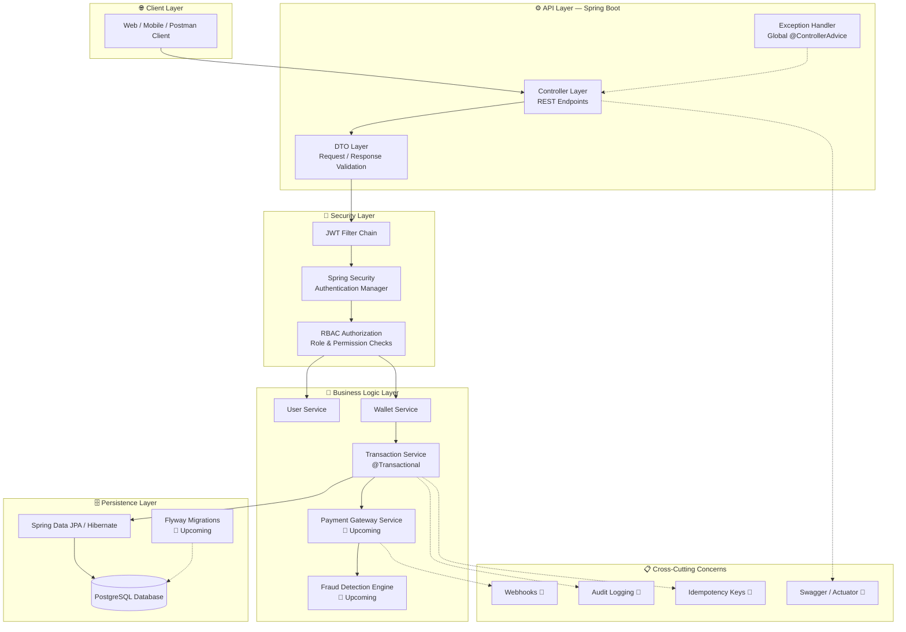
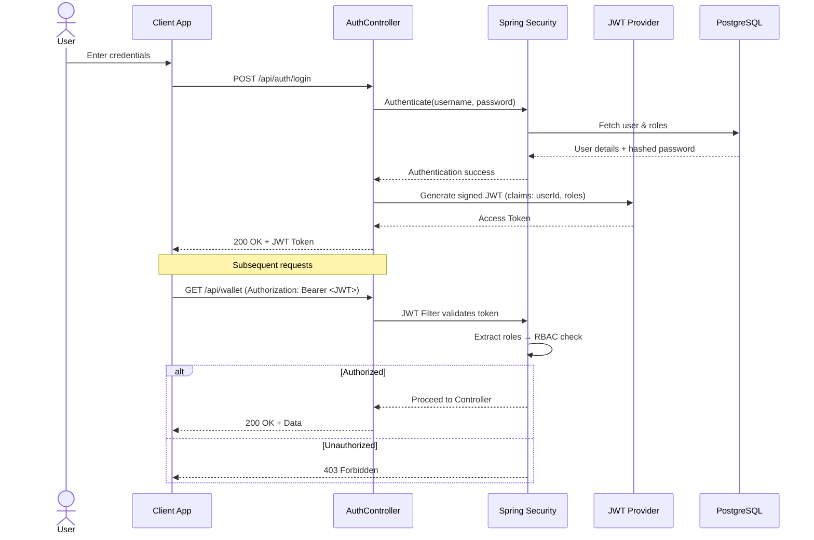
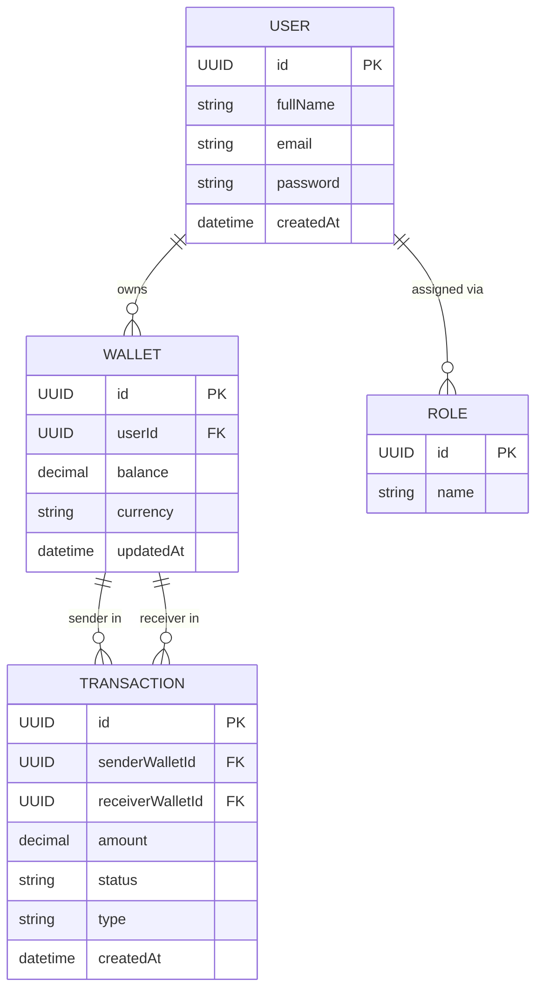
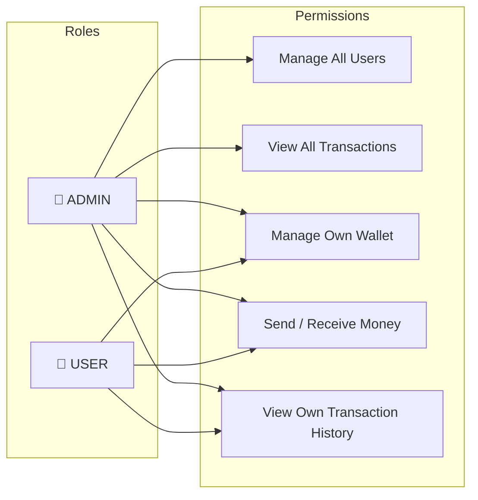
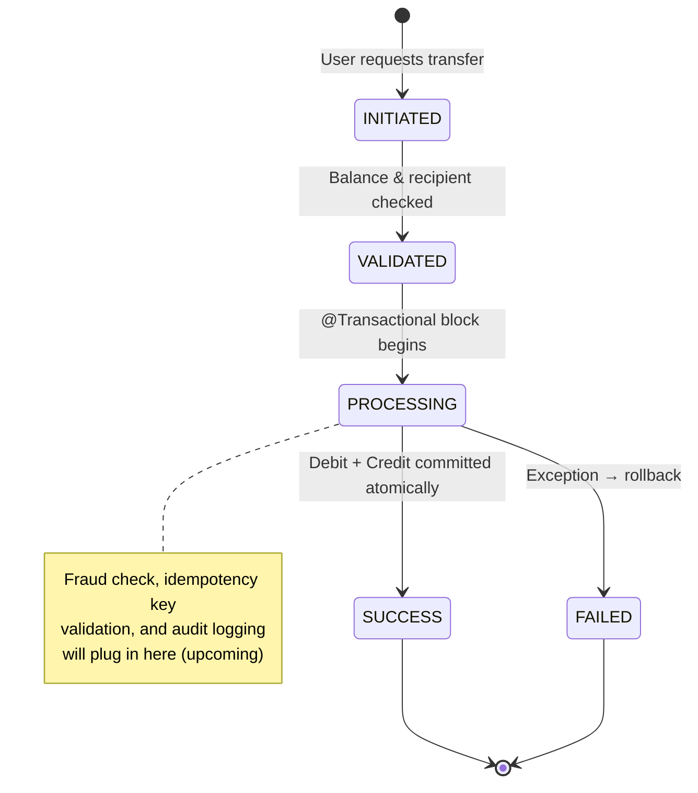

# 💰 PayMoney — Digital Wallet & Payment Processing Backend

<p align="center">
  
  
  
  
  
  
</p>

<p align="center">
  <b>A production-grade, secure, and scalable digital wallet & payment backend</b><br/>
  built with Spring Boot, PostgreSQL, JWT authentication, and role-based access control —
  designed the way real fintech systems (Paytm, Razorpay, Stripe-style engines) are architected.
</p>

---

## 📖 Table of Contents

- [Overview](#-overview)
- [System Architecture](#-system-architecture)
- [Tech Stack](#-tech-stack)
- [Core Features](#-core-features)
- [Authentication & Security Flow](#-authentication--security-flow)
- [Database Design (ER Diagram)](#-database-design-er-diagram)
- [Role-Based Access Control](#-role-based-access-control-rbac)
- [Transaction Lifecycle](#-transaction-lifecycle)
- [Project Structure](#-project-structure)
- [Development Roadmap](#-development-roadmap)
- [Getting Started](#-getting-started)
- [Skills Demonstrated](#-skills-demonstrated)

---

## 🧭 Overview

**PayMoney** is a backend system that simulates the core of a real-world digital wallet
and payment platform — similar in spirit to systems like Paytm or a simplified Stripe.
It is being built module-by-module (phase-by-phase) with production practices:
clean layering, DTO-based contracts, centralized exception handling, JWT-secured
authentication, RBAC-based authorization, and ACID-safe wallet transactions.

The project is in **active development** — core banking primitives (users, wallets,
authentication, authorization, transactions) are complete, and payment-gateway-grade
features (refunds, fraud detection, idempotency, webhooks, audit logs) are next.

---

## 🏗 System Architecture



---

## 🛠 Tech Stack

| Layer | Technology |
|---|---|
| **Language** | Java 21 |
| **Framework** | Spring Boot 3.x |
| **Build Tool** | Maven |
| **Security** | Spring Security + JWT (JSON Web Tokens) |
| **Authorization** | Role-Based Access Control (RBAC) |
| **Database** | PostgreSQL |
| **ORM** | Spring Data JPA / Hibernate |
| **Validation** | Jakarta Bean Validation (`@Valid`, DTOs) |
| **Error Handling** | Global Exception Handling (`@ControllerAdvice`) |
| **Transactions** | Spring `@Transactional` (ACID-safe wallet operations) |
| **Version Control** | Git & GitHub |
| **Planned** | Flyway, Swagger/OpenAPI, Spring Actuator, Scheduler, Docker, JUnit + Mockito |

---

## ✅ Core Features

### Implemented

| # | Module | Description |
|---|---|---|
| 1 | **User Management** | User registration, profile management, PostgreSQL persistence via JPA |
| 2 | **DTO + Validation** | Clean request/response contracts, input validation, centralized exception handling |
| 3 | **Authentication (JWT)** | Stateless login/signup flow secured with Spring Security + JWT access tokens |
| 4 | **Authorization (RBAC)** | Role-based endpoint protection (e.g. `USER`, `ADMIN`) using method/URL-level security |
| 5 | **Wallet Management** | Create & manage user wallets, balance tracking, wallet-to-user linkage |
| 6 | **Transactions** | Atomic fund transfers using `@Transactional`, preventing race conditions & partial updates |

### 🚧 In Progress / Upcoming

| # | Module | Purpose |
|---|---|---|
| 7 | **Payment Gateway Integration** | Connect wallet to external payment providers (e.g. Razorpay/Stripe-style flow) |
| 8 | **Refunds** | Reverse transactions safely with full audit trail |
| 9 | **Fraud Detection** | Rule-based checks (velocity limits, suspicious patterns) before transaction approval |
| 10 | **Idempotency** | Idempotency-key mechanism to make retried payment requests safe |
| 11 | **Webhooks** | Async event notifications for payment status changes |
| 12 | **Audit Logging** | Immutable log of every sensitive action (who did what, when) |
| 13 | **Flyway + Swagger + Actuator + Scheduler** | DB versioning, live API docs, health monitoring, scheduled jobs |
| 14 | **Testing + Docker + Polish** | Unit/integration tests (JUnit + Mockito), containerization, final hardening |

---

## 🔐 Authentication & Security Flow



---

## 🗄 Database Design (ER Diagram)



---

## 🛡 Role-Based Access Control (RBAC)



---

## 💸 Transaction Lifecycle



---

## 📁 Project Structure

```
paymoney/
├── src/main/java/com/paymoney/
│   ├── config/            # Security config, JWT filters, beans
│   ├── controller/        # REST controllers (User, Wallet, Auth, Transaction)
│   ├── dto/                # Request/Response DTOs
│   ├── entity/            # JPA entities (User, Wallet, Transaction, Role)
│   ├── exception/         # Custom exceptions + GlobalExceptionHandler
│   ├── repository/        # Spring Data JPA repositories
│   ├── security/          # JWT provider, filters, UserDetailsService
│   ├── service/           # Business logic (User, Wallet, Transaction)
│   └── PayMoneyApplication.java
├── src/main/resources/
│   └── application.yml
├── src/test/               # 🚧 JUnit + Mockito tests (upcoming)
├── pom.xml
└── README.md
```

---

## 🗺 Development Roadmap

| Phase | Module | Status |
|---|---|---|
| 1 | Project Setup + Git | ✅ Done |
| 2 | User Management + PostgreSQL + JPA | ✅ Done |
| 3 | DTO + Validation + Exception Handling | ✅ Done |
| 4 | Authentication + Spring Security + JWT | ✅ Done |
| 5 | Authorization + RBAC | ✅ Done |
| 6 | Wallet Management | ✅ Done |
| 7 | Transactions + `@Transactional` | ✅ Done |
| 8 | Payment Gateway | ⬜ Planned |
| 9 | Refunds | ⬜ Planned |
| 10 | Fraud Detection | ⬜ Planned |
| 11 | Idempotency | ⬜ Planned |
| 12 | Webhooks | ⬜ Planned |
| 13 | Audit Logging | ⬜ Planned |
| 14 | Flyway + Swagger + Actuator + Scheduler | ⬜ Planned |
| 15 | Testing + Docker + Final Polish | ⬜ Planned |

**Progress: 7 / 15 phases complete (~47%)**

```mermaid
gantt
    title PayMoney Development Progress
    dateFormat  X
    axisFormat %s
    section Completed
    Project Setup + Git            :done, p1, 0, 1
    User Management + JPA          :done, p2, 1, 2
    DTO + Validation                :done, p3, 2, 3
    Auth + JWT                      :done, p4, 3, 4
    RBAC                            :done, p5, 4, 5
    Wallet Management                :done, p6, 5, 6
    Transactions                    :done, p7, 6, 7
    section Upcoming
    Payment Gateway                  :active, p8, 7, 8
    Refunds                          :p9, 8, 9
    Fraud Detection                  :p10, 9, 10
    Idempotency                      :p11, 10, 11
    Webhooks                         :p12, 11, 12
    Audit Logging                    :p13, 12, 13
    Flyway+Swagger+Actuator          :p14, 13, 14
    Testing+Docker+Polish            :p15, 14, 15
```



---

## 🚀 Getting Started

### Prerequisites
- Java 21
- Maven 3.9+
- PostgreSQL 14+

### Setup

```bash
# Clone the repository
git clone https://github.com/<your-username>/paymoney.git
cd paymoney

# Configure database credentials in src/main/resources/application.yml

# Build the project
mvn clean install

# Run the application
mvn spring-boot:run
```

The API will be available at `http://localhost:8080`.

### Sample Endpoints

| Method | Endpoint | Description | Auth Required |
|---|---|---|---|
| POST | `/api/auth/signup` | Register a new user | ❌ |
| POST | `/api/auth/login` | Login and receive JWT | ❌ |
| GET | `/api/wallet` | Get current user's wallet | ✅ |
| POST | `/api/transactions/transfer` | Transfer funds between wallets | ✅ |
| GET | `/api/admin/users` | View all users (Admin only) | ✅ (ADMIN) |

> Update the table above once your actual controller endpoints are finalized.

---

## 🧠 Skills Demonstrated

- **Backend Architecture** — layered design (Controller → Service → Repository)
- **Security Engineering** — stateless JWT auth, password hashing, RBAC authorization
- **Data Modeling** — relational schema design for financial data integrity
- **Transaction Management** — ACID-safe money transfers using `@Transactional`
- **API Design** — RESTful conventions, DTO-based contracts, input validation
- **Error Handling** — centralized, consistent exception responses
- **Fintech Domain Knowledge** — wallets, ledgers, refunds, fraud checks, idempotency, webhooks
- **Clean Code Practices** — separation of concerns, Git-based version control

---

<p align="center">
  <i>Built as a hands-on deep dive into how real-world fintech backends are engineered.</i>
</p>
