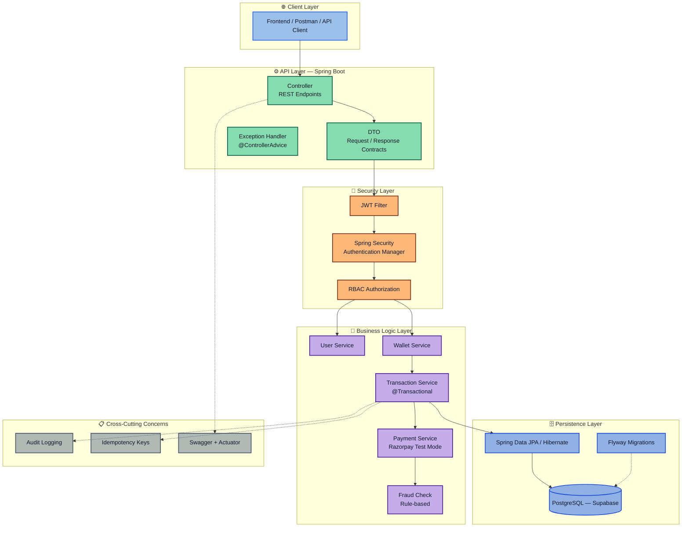
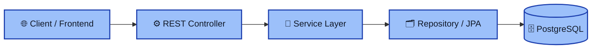
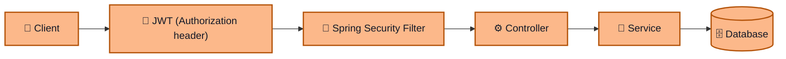
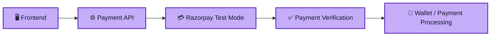
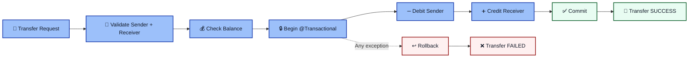
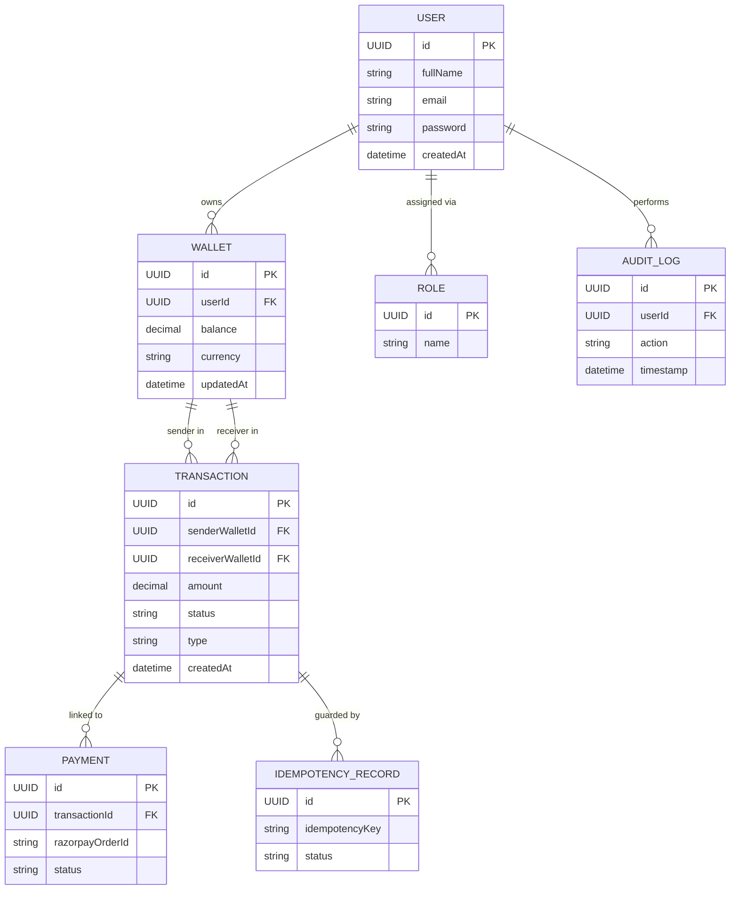
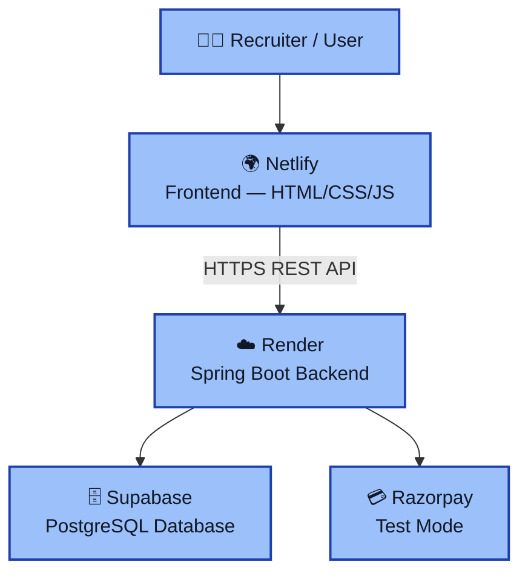

---

# 💰 PayMoney — Digital Wallet & Payment Processing Backend

<p align="center">
  
  
  
  
  
  
  
  
</p>

<p align="center">
  <b>A backend-focused digital wallet & payment processing system</b><br/>
  built with Java 21, Spring Boot 3.x, PostgreSQL and JWT-based security — designed to demonstrate how real fintech backends (Paytm/Razorpay-style engines) are architected, layered, and secured.
</p>

<p align="center">
  <a href="https://paymoney-wallet.netlify.app/"><b>🌐 Live Demo</b></a> ·
  <a href="https://github.com/VASUSINH/PayMoney"><b>📦 Repository</b></a> ·
  <a href="#-api-documentation"><b>📄 API Docs</b></a>
</p>

---

## 📖 Table of Contents

- [Live Demo](#-live-demo)
- [GitHub Repository](#-github-repository)
- [Overview](#-overview)
- [Key Features](#-key-features)
- [Tech Stack](#-tech-stack)
- [Architecture](#-architecture)
- [Project Structure](#-project-structure)
- [Core Backend Flows](#-core-backend-flows)
- [Security](#-security)
- [Database Design](#-database-design)
- [Development Phases](#-development-phases)
- [Deployment Architecture](#-deployment-architecture)
- [Testing](#-testing)
- [Running Locally](#-running-locally)
- [API Documentation](#-api-documentation)
- [Future Improvements](#-future-improvements)
- [What I Learned / Engineering Concepts Demonstrated](#-what-i-learned--engineering-concepts-demonstrated)
- [Author](#-author)

---

## 🌐 Live Demo

| Resource | Link |
|---|---|
| **Live Application (Frontend)** | [https://paymoney-wallet.netlify.app/](https://paymoney-wallet.netlify.app/) |
| **Backend Base URL** | [https://paymoney-backend-ybl6.onrender.com](https://paymoney-backend-ybl6.onrender.com) |
| **Swagger / OpenAPI Docs** | https://paymoney-backend-ybl6.onrender.com/swagger-ui/index.html
| **Health Check (Actuator)** | https://paymoney-backend-ybl6.onrender.com/actuator/health
> ⚠️ The backend is hosted on Render's free tier — the first request after inactivity may take a few seconds to respond while the instance spins up.

## 📦 GitHub Repository

🔗 [https://github.com/VASUSINH/PayMoney](https://github.com/VASUSINH/PayMoney)

---

## 🖼 Screenshots


 ### Login


 ### Dashboard


 ### Transactions
 

 ### Profile
 


---

## 🧭 Overview

**PayMoney** is a backend-focused digital wallet and payment processing application that simulates the core operations of a real-world wallet/payment platform — user authentication, wallet management, money transfers, payment gateway integration, and transaction safety mechanisms.

The project is primarily a **Java / Spring Boot backend engineering exercise**. It was built to practice and demonstrate how production backend systems are structured: layered architecture, stateless authentication, role-based authorization, ACID-safe transactions, and integration with a real (test-mode) payment gateway.

A lightweight **HTML, CSS and JavaScript frontend** was built with AI assistance to provide a usable interface for testing and demonstrating the backend APIs. Frontend development is **not** the focus of this project — my primary interest and skillset is backend engineering, and the frontend intentionally stays simple.

> 🔒 **Important:** This project does **not** process real money. Razorpay is integrated in **Test Mode** purely to simulate a payment gateway flow for learning purposes. It is not a banking system, is not PCI-DSS compliant, and is not intended for production financial use.

---

## ✅ Key Features

### Implemented

| # | Module | Description |
|---|---|---|
| 1 | **User Management** | Registration, profile handling, PostgreSQL persistence via JPA |
| 2 | **Validation & Exception Handling** | Request DTOs, Jakarta Bean Validation, centralized `@ControllerAdvice` error handling |
| 3 | **Authentication (JWT)** | Login with BCrypt password hashing, stateless JWT issuance, JWT filter for protected routes |
| 4 | **Authorization (RBAC)** | `USER` / `ADMIN` roles, endpoint and method-level access control |
| 5 | **Wallet Management** | Wallet creation, ownership validation, balance tracking, add money, withdrawal |
| 6 | **Transactions** | Wallet-to-wallet transfer, balance validation, atomic processing via `@Transactional`, transaction history |
| 7 | **Payment Gateway (Razorpay Test Mode)** | Order creation and payment verification through Razorpay's test environment |
| 8 | **Refunds** | Refund handling associated with payment/transaction records |
| 9 | **Fraud Detection (Basic)** | Simple rule-based checks (e.g. transaction limits) applied before processing — not an AI/ML system |
| 10 | **Idempotency** | Idempotency-key support so retried payment/transaction requests aren't processed twice |
| 11 | **Audit Logging** | Records of key application actions for traceability |
| 12 | **API Documentation** | Swagger / OpenAPI for exploring and testing endpoints |
| 13 | **Database Migration** | Flyway-managed, version-controlled schema changes |
| 14 | **Health Monitoring** | Spring Boot Actuator health endpoint |
| 15 | **Testing** | Unit tests using JUnit and Mockito |
| 16 | **Containerization** | Dockerized Spring Boot backend for consistent packaging/runtime |


---

## 🛠 Tech Stack

### Backend

| Layer | Technology |
|---|---|
| **Language** | Java 21 |
| **Framework** | Spring Boot 3.x |
| **Web** | Spring MVC / REST APIs |
| **Security** | Spring Security + JWT |
| **Authorization** | Role-Based Access Control (RBAC) |
| **Database** | PostgreSQL |
| **ORM** | Spring Data JPA / Hibernate |
| **Validation** | Jakarta Bean Validation |
| **Migrations** | Flyway |
| **Docs** | Swagger / OpenAPI |
| **Monitoring** | Spring Boot Actuator |
| **Payments** | Razorpay (Test Mode) |
| **Testing** | JUnit, Mockito |
| **Build Tool** | Maven |
| **Containerization** | Docker |
| **Utilities** | Lombok |

### Frontend

| Layer | Technology |
|---|---|
| **Markup / Styling / Logic** | HTML, CSS, JavaScript |
| **Purpose** | Lightweight client to consume and demonstrate the backend REST APIs |
| **Note** | Built with AI assistance. My core focus is backend development; frontend skills here are basic and functional rather than a demonstration of frontend expertise. |

---

## 🏗 Architecture

PayMoney follows a simple, standard **layered architecture**: each layer has one responsibility, and requests flow top-down through security, business logic, and persistence.



**Layer responsibilities:**

| Layer | Responsibility |
|---|---|
| **Controller** | Exposes REST API endpoints, delegates to services |
| **Service** | Contains business logic and orchestration |
| **Repository** | Database access via Spring Data JPA |
| **Entity** | JPA-mapped database tables |
| **DTO** | Request/response models decoupled from entities |
| **Mapper** | Converts between DTOs and Entities |
| **Exception** | Custom exceptions + global `@ControllerAdvice` handler |
| **Config** | Security configuration, JWT setup, application beans |

---

## 📁 Project Structure

```text
com.PayMoney
├── Controller/     # REST API endpoints (User, Wallet, Auth, Transaction, Payment)
├── Service/        # Business logic layer
├── Repository/     # Spring Data JPA repositories
├── Entity/         # JPA database entities
├── DTO/            # Request/response models
├── Mapper/         # DTO <-> Entity conversion
├── Exception/      # Custom exceptions + GlobalExceptionHandler
└── Config/         # Security configuration, JWT, application config
```

---

## 🔄 Core Backend Flows

**Standard request flow:**



**Authenticated request flow:**



**Payment flow (Razorpay Test Mode):**



**Money transfer (atomic debit + credit):**



**End-to-end functional flow:**

1. User registers.
2. User logs in — backend authenticates credentials and returns a JWT.
3. JWT is attached to subsequent requests to access protected endpoints.
4. User creates/accesses their wallet.
5. User adds money via Razorpay Test Mode.
6. User withdraws funds (subject to per-request limits, see below).
7. User transfers funds to another wallet.
8. Every transaction is recorded with status and type.
9. Idempotency keys prevent duplicate processing on retried requests.
10. Audit logs capture key actions for traceability.

> 💡 A maximum transaction amount of **₹50,000** applies per deposit, withdrawal, or transfer request (not a cap on total wallet balance).

---

## 🔐 Security

- **BCrypt** password hashing
- **JWT**-based stateless authentication
- **Spring Security** filter chain for request authentication
- **Role-Based Access Control** (`USER`, `ADMIN`) at the endpoint/method level
- **Wallet ownership validation** — users can only act on wallets they own
- **Input validation** via Jakarta Bean Validation on all request DTOs
- **Global exception handling** for consistent, safe error responses
- **Idempotency-key protection** on relevant payment/transaction endpoints
- **`@Transactional`** processing to prevent partial updates during transfers
- **Razorpay Secret Key stays server-side** — never exposed in frontend code
- No secrets or credentials are committed to the frontend or repository

---

## 🗄 Database Design

PostgreSQL, hosted via **Supabase** in the deployed environment.



> Fields shown reflect the known relationships between users, wallets, transactions, payments, idempotency records, and audit logs. Additional columns may exist in the actual schema beyond what's listed here.

---

## 🗺 Development Phases

| Phase | Module | Status |
|---|---|---|
| 1 | Project Setup + Git | ✅ Done |
| 2 | User Management + PostgreSQL + JPA | ✅ Done |
| 3 | DTO + Validation + Exception Handling | ✅ Done |
| 4 | Authentication + JWT | ✅ Done |
| 5 | Authorization + RBAC | ✅ Done |
| 6 | Wallet Management | ✅ Done |
| 7 | Transactions + `@Transactional` | ✅ Done |
| 8 | Payment Gateway (Razorpay Test Mode) | ✅ Done |
| 9 | Refunds | ✅ Done |
| 10 | Fraud Detection (basic, rule-based) | ✅ Done |
| 11 | Idempotency | ✅ Done |
| 12 | Audit Logging | ✅ Done |
| 13 | Flyway + Swagger + Actuator | ✅ Done |
| 14 | Testing + Docker + Deployment | ✅ Done |

---

## 🚀 Deployment Architecture



| Component | Technology |
|---|---|
| **Frontend hosting** | Netlify |
| **Backend hosting** | Render |
| **Database** | Supabase (PostgreSQL) |
| **Payment gateway** | Razorpay (Test Mode) |
| **Backend packaging** | Docker |

---

## 🧪 Testing

- Unit tests written with **JUnit** and **Mockito** for backend components.
- Focus is on validating service-layer business logic where implemented.
- Testing coverage is incremental and expanding alongside new modules.

---

## 💻 Running Locally

```bash
# Clone the repository
git clone https://github.com/VASUSINH/PayMoney.git
cd PayMoney

# Configure environment variables (application.yml or .env)
# - PostgreSQL connection details
# - JWT secret
# - Razorpay Test Mode API key/secret

# Build the project
mvn clean install

# Run the application
mvn spring-boot:run

# Or run via Docker
docker build -t paymoney-backend .
docker run -p 8080:8080 paymoney-backend
```

---

## 📄 API Documentation

Once running, the API can be explored and tested via **Swagger UI**:

- Local: `http://localhost:8080/swagger-ui.html`
- Deployed: https://paymoney-backend-ybl6.onrender.com/swagger-ui/index.html

Application health can be checked via **Spring Boot Actuator**:

- Local: `http://localhost:8080/actuator/health`
- Deployed: https://paymoney-backend-ybl6.onrender.com/actuator/health

---

## 🔮 Future Improvements

- Implement webhooks for asynchronous payment status updates
- Expand automated test coverage (integration tests)
- Add more granular fraud-detection rules
- Improve audit log querying/reporting
- Move deposit/withdrawal/transfer limits to configurable values
- Explore CI/CD pipeline for automated build/deploy

---

## 🎓 What I Learned / Engineering Concepts Demonstrated

- REST API design and Spring Boot backend architecture
- Stateless authentication with Spring Security and JWT
- Role-based authorization at the endpoint/method level
- Data modeling and persistence with JPA/Hibernate and PostgreSQL
- Transaction management and concurrency considerations using `@Transactional`
- Integrating a third-party payment gateway (Razorpay) in a test environment
- Designing idempotency protection for retried requests
- Implementing basic rule-based fraud checks
- Audit logging for traceability
- Database versioning with Flyway
- API documentation with Swagger/OpenAPI
- Health monitoring with Spring Boot Actuator
- Unit testing with JUnit and Mockito
- Packaging and running a Spring Boot app with Docker
- Deploying a full-stack project across separate frontend/backend/database providers

This project reflects an ongoing, hands-on effort to build backend systems the way they're structured in practice — not a claim of production-grade financial infrastructure. It is a learning and portfolio project.

---

## 👨‍💻 Author

**Ayush Sinha**

- GitHub: [VASUSINH](https://github.com/VASUSINH)
- Project Repository: [PayMoney](https://github.com/VASUSINH/PayMoney)

---

## ©️ Copyright & Usage

**Copyright © 2026 Ayush Sinha. All Rights Reserved.**

For permission or licensing inquiries, please contact the author through GitHub.
